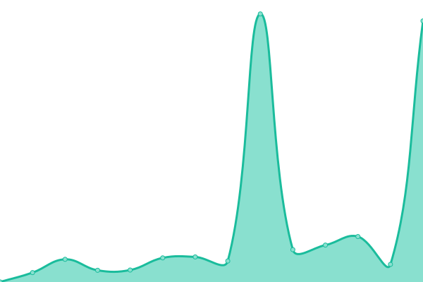
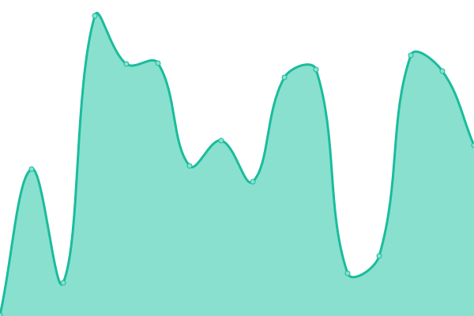
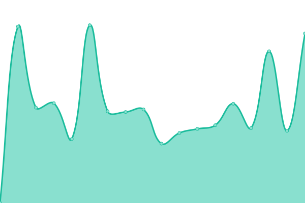

# [📈 Live Status](https://status.andywebservices.com): <!--live status--> **🟧 Partial outage**

This repository contains the open-source uptime monitor and status page for [Upptime](https://upptime.js.org), powered
by [Upptime](https://github.com/upptime/upptime).

This repo uses a slightly different source templates, [AndyWebServices/uptime-monitor](https://github.com/AndyWebServices/uptime-monitor).
These changes allow the uptime template to log into Tailscale and install a custom Root CA.

With [Upptime](https://upptime.js.org), you can get your own unlimited and free uptime monitor and status page, powered entirely by a
GitHub repository. We use [Issues](https://github.com/upptime/upptime/issues) as incident reports, [Actions](https://github.com/AndyWebServices/upptime/actions) as uptime monitors, and [Pages](https://status.andywebservices.com) for the
status page.

<!--start: status pages-->
<!-- This summary is generated by Upptime (https://github.com/upptime/upptime) -->
<!-- Do not edit this manually, your changes will be overwritten -->
<!-- prettier-ignore -->
| URL | Status | History | Response Time | Uptime |
| --- | ------ | ------- | ------------- | ------ |
|  [Home Assistant](https://ha.andywebservices.com) | 🟩 Up | [home-assistant.yml](https://github.com/AndyWebServices/upptime/commits/HEAD/history/home-assistant.yml) | 

 875ms
     
 | 

<a href="https://status.andywebservices.com/history/home-assistant">97.28%</a>
    

|  [FreeIPA](https://auth.andywebservices.com) | 🟩 Up | [free-ipa.yml](https://github.com/AndyWebServices/upptime/commits/HEAD/history/free-ipa.yml) | 

 393ms
     
 | 

<a href="https://status.andywebservices.com/history/free-ipa">97.29%</a>
    

|  [Unifi](https://unifi.andywebservices.com) | 🟩 Up | [unifi.yml](https://github.com/AndyWebServices/upptime/commits/HEAD/history/unifi.yml) | 

 211ms
     
 | 

<a href="https://status.andywebservices.com/history/unifi">97.27%</a>
    

|  [AndyWebServices Certificate Authority](https://awsca.aws) | 🟩 Up | [andy-web-services-certificate-authority.yml](https://github.com/AndyWebServices/upptime/commits/HEAD/history/andy-web-services-certificate-authority.yml) | 

 131ms
     
 | 

<a href="https://status.andywebservices.com/history/andy-web-services-certificate-authority">97.43%</a>
    

|  [Pihole](https://pihole.aws) | 🟩 Up | [pihole.yml](https://github.com/AndyWebServices/upptime/commits/HEAD/history/pihole.yml) | 

 221ms
     
 | 

<a href="https://status.andywebservices.com/history/pihole">97.29%</a>
    

|  [Octoprint](https://octoprint.aws) | 🟥 Down | [octoprint.yml](https://github.com/AndyWebServices/upptime/commits/HEAD/history/octoprint.yml) | 

 239ms
     
 | 

<a href="https://status.andywebservices.com/history/octoprint">72.94%</a>
    

|  [Grocy](https://grocy.aws) | 🟩 Up | [grocy.yml](https://github.com/AndyWebServices/upptime/commits/HEAD/history/grocy.yml) | 

 601ms
     
 | 

<a href="https://status.andywebservices.com/history/grocy">95.88%</a>
    

<!--end: status pages-->

[**Visit our status website →**](https://status.andywebservices.com)

## 📄 License

- Powered by: [Upptime](https://github.com/upptime/upptime)
- Code: [MIT](./LICENSE) © [Anand Chowdhary](https://anandchowdhary.com), supported by [Pabio](https://pabio.com)
- Data in the `./history` directory: [Open Database License](https://opendatacommons.org/licenses/odbl/1-0/)
